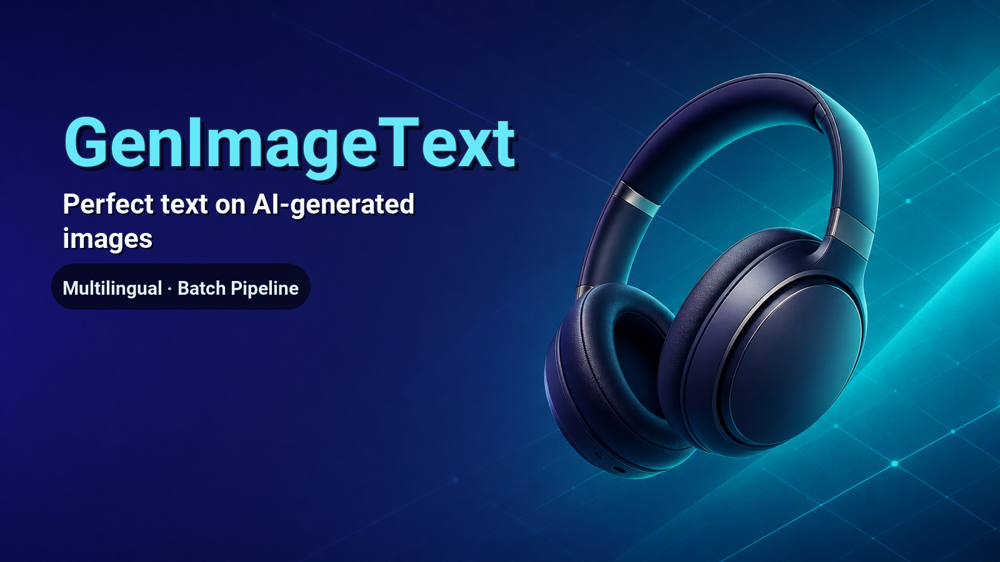

# GenImageText

[](https://opensource.org/licenses/MIT)

> ⚠️ **IMPORTANT**: This is NOT an image generator. It adds perfect text to images created by your AI tools.

> Fix imperfect AI-generated text in images by separating image generation and text overlay.



🌐 **English** | [简体中文](README.zh-CN.md) | [繁體中文](README.zh-TW.md) | [日本語](README.ja.md) | [한국어](README.ko.md)

---

## What This Tool Does

AI-generated images often contain garbled or imperfect text, especially for Chinese, Japanese, Korean (CJK) and other non-Latin scripts. **This tool solves this problem** by separating the workflow:

1. **This Skill** separates your prompt → image-only prompt + text requirements
2. **Your AI Tool** generates the clean base image (Midjourney, GPT Image 2, Stable Diffusion, etc.)
3. **This Skill** analyzes the image for optimal text placement
4. **This Skill** renders perfect text with professional typography

---

## Supported AI Image Generators

Use **any** of these tools for Step 2 (image generation):

| Tool | Platform | Best For |
|------|----------|----------|
| **Midjourney** | Discord | High-quality artistic images |
| **GPT Image 2** | ChatGPT, OpenAI API | Easy to use, great prompt understanding |
| **Stable Diffusion** | Local, Hugging Face, Replicate | Open-source, customizable |
| **Google Gemini/Imagen** | Google AI Studio, Gemini Pro | Integrated with Google's ecosystem |
| **Adobe Firefly** | Adobe Creative Suite | Commercial use, safe for business |
| **Microsoft Bing Image Creator** | Bing, Microsoft Designer | Free, powered by GPT Image |
| **Flux.1** | API, Local | High-quality open-source model |
| **Leonardo.ai** | Web, App | Game assets, concept art |
| **Ideogram** | Web | Text rendering in images |
| **Playground AI** | Web | Free tier available |

**Key Point**: This skill does NOT generate images. It only adds text to images created by the tools above.

---

## For AI Agents (Natural Language Installation)

Copy and paste this prompt to your LLM agent (Claude Code, Kimi Code, Cursor, etc.):

```
Install the GenImageText skill to my workspace.
Clone from: https://github.com/stephenlzc/GenImageText
Set up all dependencies and verify the installation by running a test with Chinese text extraction.
```

---

## Installation

### Requirements
- Python 3.8+
- Python packages: `pip install Pillow numpy`

### Git Clone

```bash
git clone https://github.com/stephenlzc/GenImageText
cd GenImageText
```

---

## Usage

### Step 1: Separate Prompt (This Skill)

```python
from scripts.prompt_separator import separate_prompt

result = separate_prompt("Movie poster with 'Interstellar' title")
# result['image_prompt']: Clean visual description without text
# result['text_requirements']: Structured text data
```

### Step 2: Generate Base Image (Your AI Tool)

> ⚠️ **This step uses YOUR AI image generator, NOT this skill.**

Use the `image_prompt` with your preferred AI image generator:
- **Midjourney** - Discord-based generation
- **GPT Image 2** (ChatGPT Plus, OpenAI API)
- **Stable Diffusion** - Local or cloud-based
- **Google Gemini/Imagen**
- **Adobe Firefly**
- **Microsoft Bing Image Creator** (Free)
- **Any other AI image tool you prefer**

### Step 3: Analyze Image (This Skill)

```python
from scripts.image_analyzer import analyze_image, get_text_placement_suggestions

analysis = analyze_image("base_image.png", text_requirements)
placements = get_text_placement_suggestions(analysis, text_requirements)
```

### Step 4: Render Text (This Skill)

```python
from scripts.text_renderer import render_text_on_image

output_path = render_text_on_image(
    image_path="base_image.png",
    output_path="final_image.png",
    placements=placements,
    user_choices={
        "font_style": "modern",
        "effects": ["shadow", "outline"]
    }
)
```

---

## Multilingual Batch Mode (E-commerce · Academic · Medical)

Turn a single text-free source image into a complete localized asset set: **1 base image × 7 bundled languages** (`en`, `de`, `ja`, `ko`, `zh-CN`, `zh-TW`, and `ar`) **→ N finished images** in one batch — covering e-commerce, academic, and medical scenes.

- **Configuration-driven templates** — eight ready-to-use presets are included in [`presets/`](presets/):

  **E-commerce**

  | Preset | Canvas | Theme |
  |---|---|---|
  | `amazon_main_image` | 2000×2000 | Wireless earbuds main image (electronics) |
  | `shopify_banner` | 2400×1200 | Summer sneaker / fashion banner |
  | `social_square` | 1080×1080 | Skincare serum social square (beauty) |
  | `poster_a4` | 2480×3508 | Smartwatch promotion poster |
  | `coffee_promo` | 1080×1080 | Coffee & food promo square |
  | `home_decor_banner` | 2400×1200 | Nordic home decor banner |

  **Academic & Medical**

  | Preset | Canvas | Theme |
  |---|---|---|
  | `academic_flowchart` | 2400×1350 | Academic research flowchart (4 nodes) |
  | `medical_mechanism` | 1600×2000 | Medical mechanism diagram (3 stages) |

- **Aesthetic layout engine** — analyzes base-image brightness and safe zones, then intelligently adjusts text position, contrast, and effects for readability.
- **Rich text effects** — `shadow`, `outline`, `glow`, translucent `backdrop`, and automatic pill-shaped badges. Effects are parameterised: soft shadows (`shadow_blur`), gradient text (`gradient` + `gradient_from`/`gradient_to`/`gradient_angle`), and tunable `backdrop_opacity`/`backdrop_radius`/`glow_radius`.
- **Font weight hierarchy** — each text layer accepts `font_weight` (`light`/`regular`/`medium`/`bold`/`black`) and resolves to the matching weight of the language-appropriate typeface.
- **Base-image prompt diversification** — `gen_ecommerce.py prompt` accepts `--style` / `--mood` / `--palette` / `--material` / `--composition` (plus `--count`, `--seed`, `--variant`, `--list`) to derive multiple varied base-image prompts from a single preset, and a preset can hand-author `base_image_prompt_variants`.
- **Design tokens & themes** — templates centralise their look in a `theme.tokens` block and layers reference `$token` placeholders instead of hardcoding values; `gen_ecommerce.py themes` lists 7 built-in themes and `--theme <name>` on `render`/`batch` re-styles the whole template in one flag.
- **Full RTL support** — Arabic and other right-to-left text are shaped correctly with `raqm`.
- **Four-way concurrent batching** — renders multiple language variants in parallel for faster delivery.

### Quick Start

```bash
.venv/bin/python gen_ecommerce.py init --preset amazon_main_image --project-dir projects/my-product
.venv/bin/python gen_ecommerce.py batch --config projects/my-product/template.yaml --base-image projects/my-product/sample_base_image.png --output projects/my-product/output
ls projects/my-product/output
```

See the [complete e-commerce guide](README_ECOMMERCE.md) and browse the [built-in presets](presets/) for templates, translations, and rendered examples.

---

## Font Handling

Fonts are loaded with the following priority:

1. **User-provided font path**: If specified
2. **Skill assets**: Check `assets/fonts/` directory
3. **System fonts**: Search common system font directories
4. **Fallback**: Default PIL font

### Font Recommendations by Language

#### 简体中文 (Simplified Chinese)
| Font File | Font Name | Style | Best For |
|-----------|-----------|-------|----------|
| `NotoSansCJKsc-Bold.otf` | 思源黑体 Bold | Modern | Posters, tech style, business |
| `NotoSerifCJKsc-Bold.otf` | 思源宋体 Bold | Traditional | Cultural themes, formal documents |

#### 繁體中文 (Traditional Chinese)
| Font File | Font Name | Style | Best For |
|-----------|-----------|-------|----------|
| `NotoSansCJKtc-Bold.otf` | 思源黑體 Bold | Modern | Taiwan/Hong Kong, business docs |

#### 한국어 (Korean)
| Font File | Font Name | Style | Best For |
|-----------|-----------|-------|----------|
| `NotoSansCJKkr-Bold.otf` | 본고딕 Bold | Modern | Korean posters, modern design |

#### English / Latin
| Font File | Font Name | Style | Best For |
|-----------|-----------|-------|----------|
| `Roboto-Bold.ttf` | Roboto Bold | Modern | Tech posters, clean designs |
| `OpenSans-Bold.ttf` | Open Sans Bold | Humanist | Web content, versatile use |

### Download Fonts

You can manually download fonts from Google Fonts or Noto Fonts and place them in `assets/fonts/`:

- **Noto CJK Fonts**: https://www.google.com/get/noto/
- **Roboto**: https://fonts.google.com/specimen/Roboto
- **Open Sans**: https://fonts.google.com/specimen/Open+Sans

All fonts are free for commercial use under SIL Open Font License or Apache License 2.0.

---

## Project Structure

```
GenImageText/
├── scripts/                # Python scripts
│   ├── prompt_separator.py
│   ├── image_analyzer.py
│   └── text_renderer.py
├── assets/fonts/           # Fonts directory
└── references/             # Reference materials
```

---

## Credits

All preset sample base images (`presets/*/sample_base_image.png`) and the hero base image (`assets/hero_base.png`) in this repository were generated with [**codex-image-gen**](https://github.com/stephenlzc/codex-image-gen), a sister project by the same author. It uses your local Codex CLI OAuth login to generate images for free, with no API key required.

If you need clean, text-free source artwork before adding typography with GenImageText, codex-image-gen is a natural companion and highly recommended.

---

## License

MIT © [stephenlzc](https://github.com/stephenlzc)

---

## 🌍 Languages

- [简体中文](README.zh-CN.md) - 简体中文文档
- [繁體中文](README.zh-TW.md) - 繁體中文文檔  
- [日本語](README.ja.md) - 日本語ドキュメント
- [한국어](README.ko.md) - 한국어 문서
