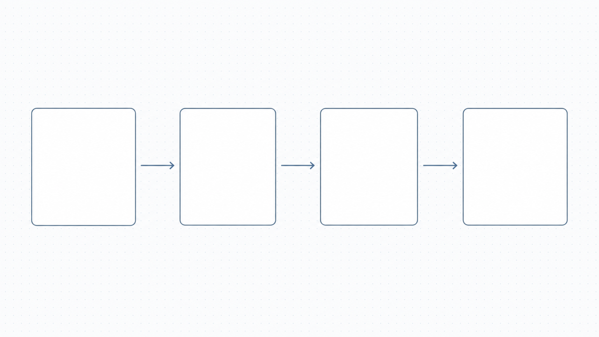
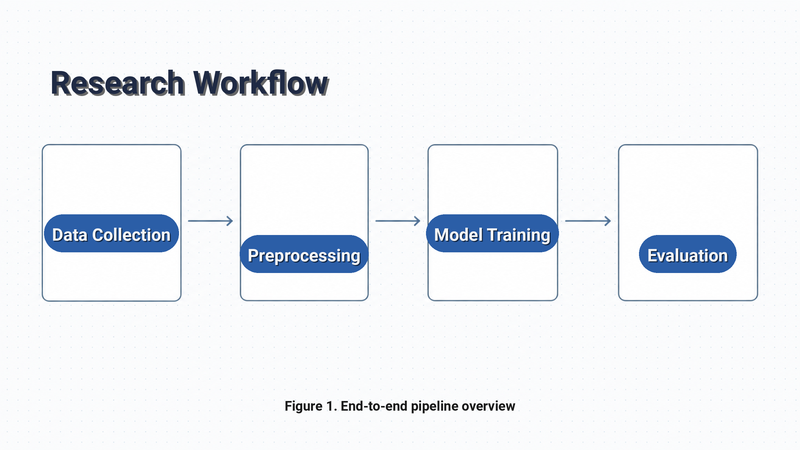
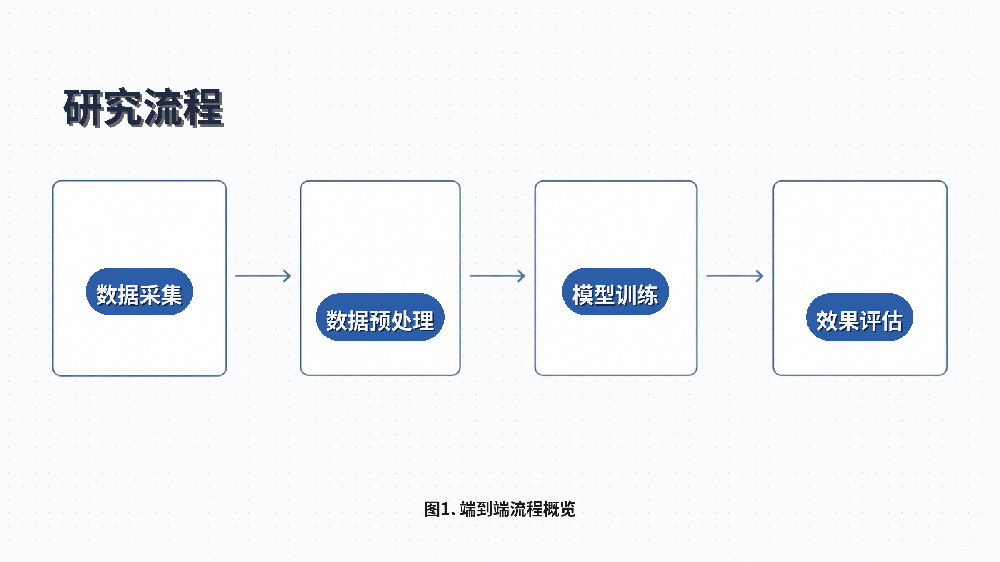
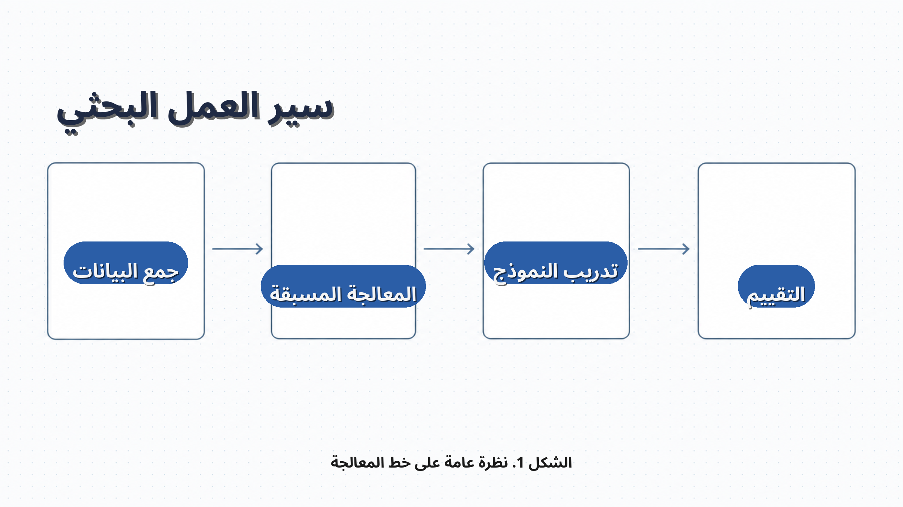

# academic_flowchart Preset

Academic research workflow / pipeline diagram template (2400×1350, 16:9) for
conference talks, journal papers and thesis-defense slides. Six text layers
laid out on a clean minimalist academic background: a top-left title in deep
slate blue, four horizontally arranged pill-shaped node labels in academic
blue, and a bottom-center figure caption in muted gray. Translations for
seven languages.

## Layout

```
+----------------------------------------------------------+
|                                                          |
|  [title]            y=180, 96px     #1F2A44 + light      |
|                                     shadow               |
|                                                          |
|                                                          |
|   [node1]    ->    [node2]    ->    [node3]    ->   [node4] |
|    x=334           x=912            x=1477          x=2063   |
|    y=667           y=729            y=667           y=729    |
|    badge pill  #2B5EA7FF backdrop, white text             |
|                                                          |
|                                                          |
|  [footer]           y=1240, 40px    #5A6478 figure caption |
+----------------------------------------------------------+
```

The four pills sit on two horizontal bands (nodes 1/3 at y=667, nodes 2/4 at y=729)
to balance the layout composer's per-pair minimum gap. Both bands stay comfortably
inside the base image's rectangle band (y=432–903).

## Text layers

| Name  | Type  | Anchor        | Font size | Effects          | Color / Backdrop                          | Notes |
|-------|-------|---------------|-----------|------------------|-------------------------------------------|-------|
| title | text  | top-left      | 96        | shadow           | `#1F2A44` text                            | Deep slate-blue heading, light drop shadow only |
| node1 | badge | center        | 52        | shadow, backdrop | `#FFFFFF` text, `#2B5EA7FF` pill          | Stage 1 of the pipeline (leftmost box) |
| node2 | badge | center        | 52        | shadow, backdrop | `#FFFFFF` text, `#2B5EA7FF` pill          | Stage 2 of the pipeline |
| node3 | badge | center        | 52        | shadow, backdrop | `#FFFFFF` text, `#2B5EA7FF` pill          | Stage 3 of the pipeline |
| node4 | badge | center        | 52        | shadow, backdrop | `#FFFFFF` text, `#2B5EA7FF` pill          | Stage 4 of the pipeline (rightmost box) |
| footer | text | bottom-center | 40        | -                | `#5A6478` text                            | "Figure 1." caption line, muted gray |

All six layers are validated against the optional PIL-renderer knobs in
`scripts/config_loader.py` (`backdrop_color`, `stroke_color`, `stroke_width`,
`glow_color`, `padding`). The four `node*` layers use `type: "badge"` plus
`backdrop` effect, which auto-renders a pill (round radius = half the text
block height) instead of a flat rectangle — matching the four rounded
rectangle placeholders in the base image.

## Palette

The base image is light cool gray with a subtle dotted grid, so the text
layers are tuned to that muted academic look instead of fighting it:

- `#1F2A44` deep slate blue — title (papers-and-slides authority without
  feeling heavy)
- `#FFFFFF` pure white — node text on academic blue pill
- `#2B5EA7` academic blue — node backdrop pill (the journal-paper blue
  used by IEEE/ACM templates)
- `#5A6478` muted slate gray — figure caption (subordinate, doesn't compete
  with the heading)

## Safe zones

Three safe zones are declared in `safe_zones` to keep the relevant regions
of the base image clear of busy detail:

- `title_zone` (80, 100) → (2320, 300)    — title placement
- `node_band`  (80, 420) → (2320, 920)    — horizontal band of the four
  pipeline boxes (the arrow row lives in this strip too)
- `footer_zone` (80, 1180) → (2320, 1300) — figure caption placement

## Translations

`translations/<lang>.json` provides the per-language copy for each of the
six layer keys: `title`, `node1`, `node2`, `node3`, `node4`, `footer`.

Bundled languages: `en`, `de`, `ja`, `ko`, `ar`, `zh-CN`, `zh-TW`. Arabic
(`ar`) is shaped with raqm through PIL (NotoSansArabic-Bold.ttf) and uses
Arabic-Indic-friendly wording — no `#` glyphs, no embedded Latin punctuation
that the Arabic font lacks.

## Usage

To validate schema, fonts, layout and translation key coverage:

```bash
.venv/bin/python gen_ecommerce.py validate \
  --config presets/academic_flowchart/template.yaml
```

To render a single language:

```bash
.venv/bin/python gen_ecommerce.py render \
  --config presets/academic_flowchart/template.yaml \
  --base-image presets/academic_flowchart/sample_base_image.png \
  --lang <LANG> \
  --output presets/academic_flowchart/examples/academic_flowchart_<LANG>.png
```

To render every bundled language into a directory:

```bash
.venv/bin/python gen_ecommerce.py batch \
  --config presets/academic_flowchart/template.yaml \
  --base-image presets/academic_flowchart/sample_base_image.png \
  --output /tmp/academic_flowchart_outputs/
```

To add another language, drop a `<code>.json` file with the same six keys
into `translations/` — no config changes are required.

## Showcase

The showcase base image and three rendered variants are bundled.

### Base image


*Base background generated by `codex-image-gen` (2400×1350, no embedded
text). Light cool gray with a subtle dotted grid; four empty rounded
rectangle placeholders connected left-to-right by thin elegant arrows;
generous negative space at the top (title) and bottom (caption).*

### English render


*English (`en`) — "Research Workflow" deep slate-blue title in the top-left;
four white labels in academic-blue pills ("Data Collection" → "Preprocessing"
→ "Model Training" → "Evaluation") centered over the four boxes;
"Figure 1. End-to-end pipeline overview" muted gray caption at the bottom.*

### Chinese render


*Chinese (`zh-CN`) — "研究流程" title, "数据采集 / 数据预处理 / 模型训练 /
效果评估" pills (NotoSansCJKsc-Bold), and "图1. 端到端流程概览" caption.
CJK glyphs render at native weight and read cleanly inside the pill; the
rest of the layout matches the English variant.*

### Arabic render


*Arabic (`ar`) — "سير العمل البحثي" deep slate-blue title (right-aligned via
the layout composer), four pills "جمع البيانات / المعالجة المسبقة / تدريب
النموذج / التقييم" shaped with raqm through PIL, and "الشكل 1. نظرة عامة
على خط المعالجة" caption. Anchors flipped for RTL; pills still land on top
of the same four boxes.*

All three renders use the PIL pipeline with the aesthetic layout engine
enabled — positions, contrast and effect enhancements are recorded in the
per-layer `layout_adjustments` block of every render report.