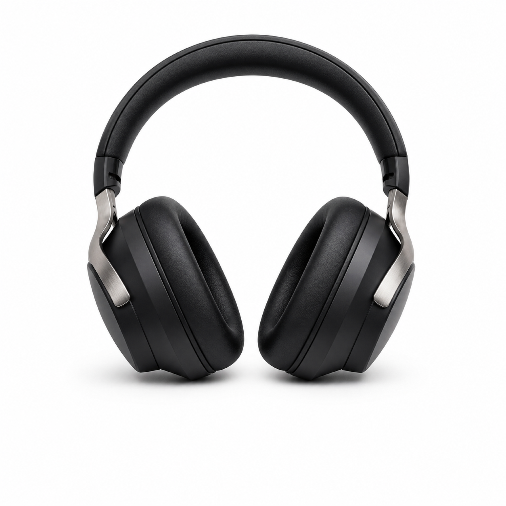
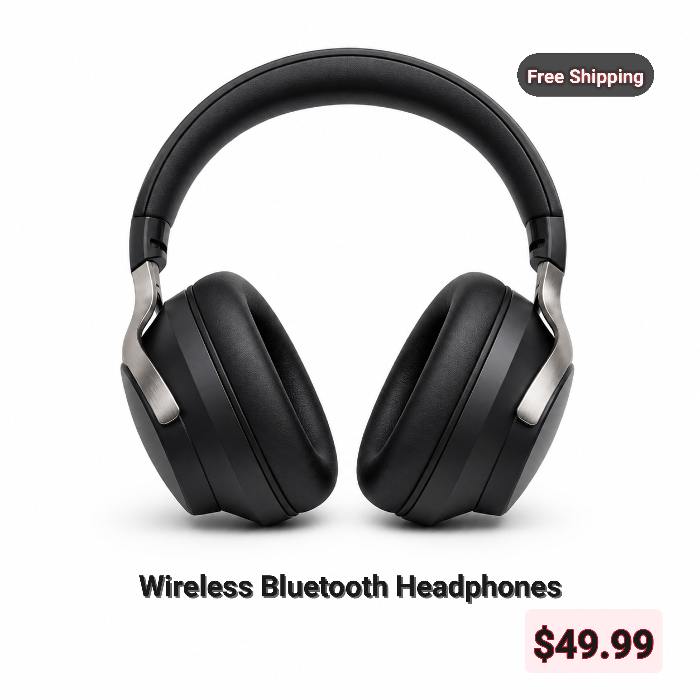
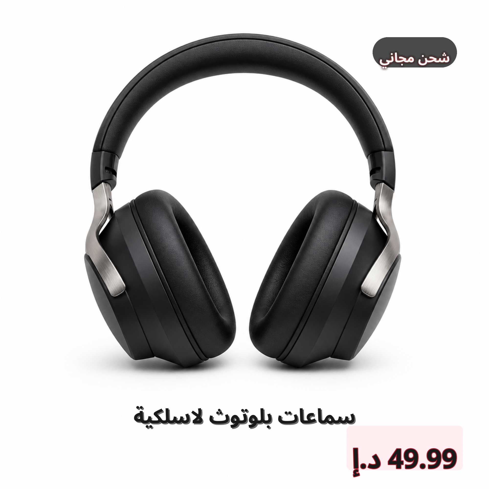
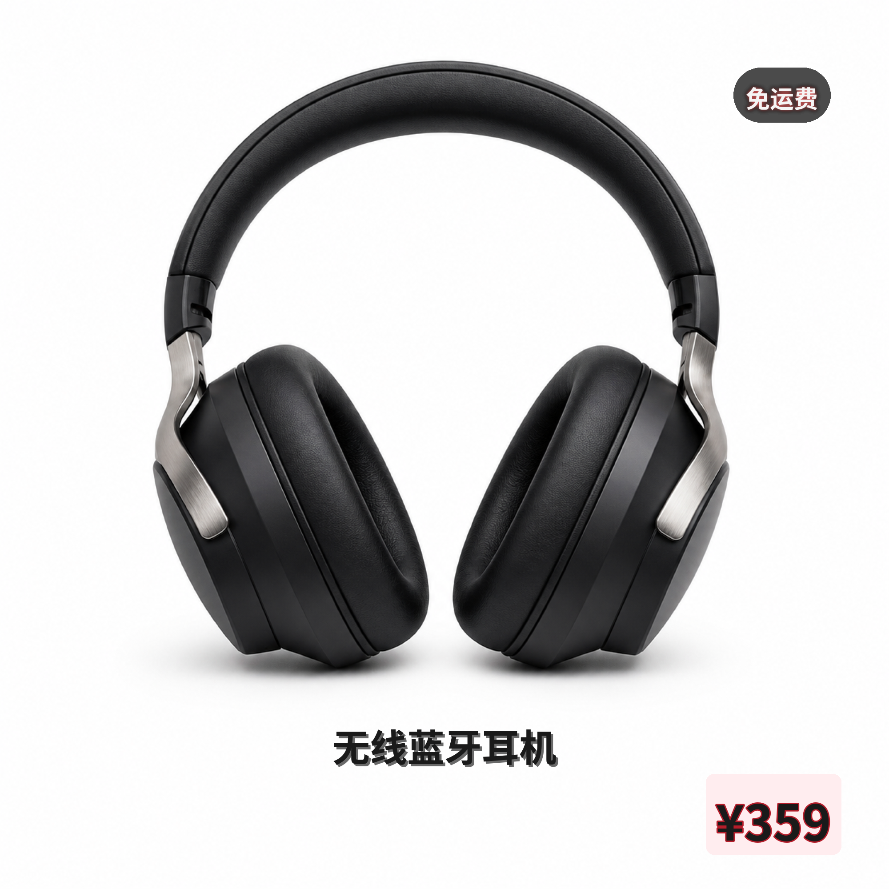

# Amazon Main Image Preset

Preset for an Amazon-style product main image (2000×2000). Bundles a
template (`template.yaml`) and one translation file per locale
(`translations/<lang>.json`) so the batch renderer can stamp the same
composition into every language without re-authoring text.

## Layout

| Layer          | Type   | Anchor        | x   | y   | Font size | Effects  | Color     | Notes            |
|----------------|--------|---------------|-----|-----|-----------|----------|-----------|------------------|
| `product_title` | text   | bottom-center | 1000 | 1750 | 72   | shadow   | `#1a1a1a` | RTL-aware (flip) |
| `price`         | price  | bottom-right  | 1700 | 1850 | 96   | outline  | `#e63946` | Bold red accent  |
| `badge`         | badge  | top-right     | 1800 | 200  | 48   | glow     | `#FFFFFF` | Short label      |

Two safe zones are declared for image analysis hints (`bottom_center`,
`bottom_right`); they have no extra effect on rendering.

## Locales

- `en` — English (US)
- `de` — German
- `ja` — Japanese
- `ko` — Korean
- `ar` — Arabic (RTL; `product_title` flips automatically)

Each JSON file exposes the keys `product_title`, `price`, `cta`, and
`badge`. `cta` is reserved for a future CTA layer and is not yet
consumed by any `text_layer` in `template.yaml`.

## Loading the preset

```python
import sys, os
sys.path.insert(0, os.path.join(os.path.dirname(__file__), "..", ".."))

from scripts.config_loader import load_config, validate_config_file

cfg = load_config("presets/amazon_main_image/template.yaml")
warnings = validate_config_file("presets/amazon_main_image/template.yaml")
print(cfg.text_layers[0].name, cfg.canvas_width, cfg.canvas_height)
```

The `default_font` of every layer is `Roboto-Bold.ttf`; `fallback_fonts`
chain through `OpenSans-Bold.ttf`, `NotoSansCJKsc-Bold.otf`, and
`NotoSansCJKkr-Bold.otf` so CJK and (current) RTL output render even
when the Latin font cannot draw the glyphs.

## Using with `gen_ecommerce.py`

The batch renderer loads this preset directly:

```bash
.venv/bin/python gen_ecommerce.py \
    --preset presets/amazon_main_image \
    --base-image outputs/20260101/20260101_base.png \
    --locales en,de,ja,ko,ar \
    --output-dir outputs/20260101
```

CLI flags the consumer is expected to honour:

- `--preset` — directory containing `template.yaml` and `translations/`
- `--base-image` — pre-rendered AI image to overlay text on
- `--locales` — comma-separated list of languages; falls back to every
  `translations/*.json` when omitted
- `--output-dir` — destination folder; one rendered file per locale

A typical run produces `output_en.png`, `output_de.png`, … side by
side in `--output-dir`, each rendered with the locale-specific font
selected by `I18nManager.get_font_for_language`.

## Showcase

Reference renders generated from the bundled sample base image. The
base image was produced by `codex-image-gen`; the locale variants were
stamped on top by the GenImageText pipeline
(`gen_ecommerce.py render ...`) using the PIL renderer
(`scripts/text_renderer.py:render_layers_pil`) and the smart layout
engine (`scripts/layout_composer.py:compose_layout`).

### Base image



*Base image (2000×2000).* Generated by `codex-image-gen` from a
photorealistic product-photography prompt. Pure white background,
centered composition, clean negative space at the bottom 20% reserved
for the text overlay. No text, watermark, logo, or brand mark.

### English (en)



*English (en) showcase.* The `product_title` (`#1a1a1a`, bottom-center,
`shadow` only) reads bold but flat-clean against the white background.
`price` (`#e63946`, bottom-right) is anchored on a light-pink
`backdrop` pill (`#ffe8eb`, `padding: 22`) with a deeper-red outline
(`stroke_color: #b51d2a`, `stroke_width: 3`). `badge`
(`type: badge`, top-right) renders as a true pill (the renderer
forces pill geometry for `type: badge`), with a black
`backdrop_color: #1a1a1a`, white text, and a warm red
`glow_color: #ff6b6b` for an Amazon-style "hot deal" highlight.

### Arabic (ar)



*Arabic (ar) showcase.* All three layers render with the native
NotoSansArabic-Bold typeface; raqm shaping handles the connected
Arabic letterforms correctly. `product_title` has `rtl_flip: true`,
which mirrors the anchor — the bottom-center title stays visually
centered because the horizontal component of the anchor flips
`start ↔ end`, but the visual block remains centered on `x: 1000`.
`price` (`rtl_flip: false`) keeps its bottom-right anchor with the
Dirham symbol "د.إ" inside the same pink backdrop pill. `badge`
displays "شحن مجاني" inside the black pill; the warm-red glow is
applied through the same `glow` effect as the EN variant.

### Chinese Simplified (zh-CN)



*Chinese Simplified (zh-CN) showcase.* `product_title` ("无线蓝牙耳机")
uses NotoSansCJKsc-Bold via the language-aware font resolver; CJK
glyphs are square so the same `font_size: 84` occupies less horizontal
space than the Latin title. `price` ("¥359") sits in the same pink
backdrop pill. `badge` ("免运费") uses the same black pill; Chinese
characters are also dense, so the pill is slightly narrower than its
EN counterpart — the renderer auto-fits the badge text inside
`max_width: 360`.

### Smart layout and effects summary

The new render path applies several automatic adjustments that the
old CairoSVG path couldn't:

- **Position micro-tuning** (`layout_composer._adjust_position`):
  if a layer's landing spot has readability below 40, the layer is
  nudged toward a same-band safe zone (capped at 15% canvas drift).
  The white-on-white sample base never trips this trigger; layers
  stay at their configured coordinates.
- **Effect auto-escalation** (`_adjust_effects`): poor readability
  (< 40) auto-appends `backdrop` with an `auto-dark` / `auto-light`
  fill; mid readability (40–70) auto-appends `shadow`. Again, the
  white-background sample leaves both untouched.
- **Contrast correction** (`_adjust_contrast`): the text colour is
  swapped to `#1a1a1a` (dark on light) or `#f5f5f5` (light on dark)
  when the contrast against the local region (or the auto backdrop)
  is below the WCAG-style threshold of 3.0; the badge passes with
  white-on-black (#1a1a1a) and the price passes with red text on a
  light-pink backdrop, so neither colour is overridden.
- **Per-layer visual tuning**: `backdrop_color`, `stroke_color`,
  `stroke_width`, `glow_color`, and `padding` are exposed as optional
  fields on `TextLayerConfig` and consumed by the PIL renderer. The
  badge uses `type: badge` to opt into a true pill shape; the price
  uses `type: price` for a rounded-rectangle tag.
- **PIL text rendering**: CJK and Arabic glyphs are drawn through
  `ImageFont.truetype` with the language-specific font path from
  `I18nManager.get_font_for_language`, so font files resolve via
  absolute path and raqm shaping correctly produces Arabic
  connected forms. CairoSVG's missing-font failure (which produced
  tofu boxes for Arabic) is no longer a risk.
