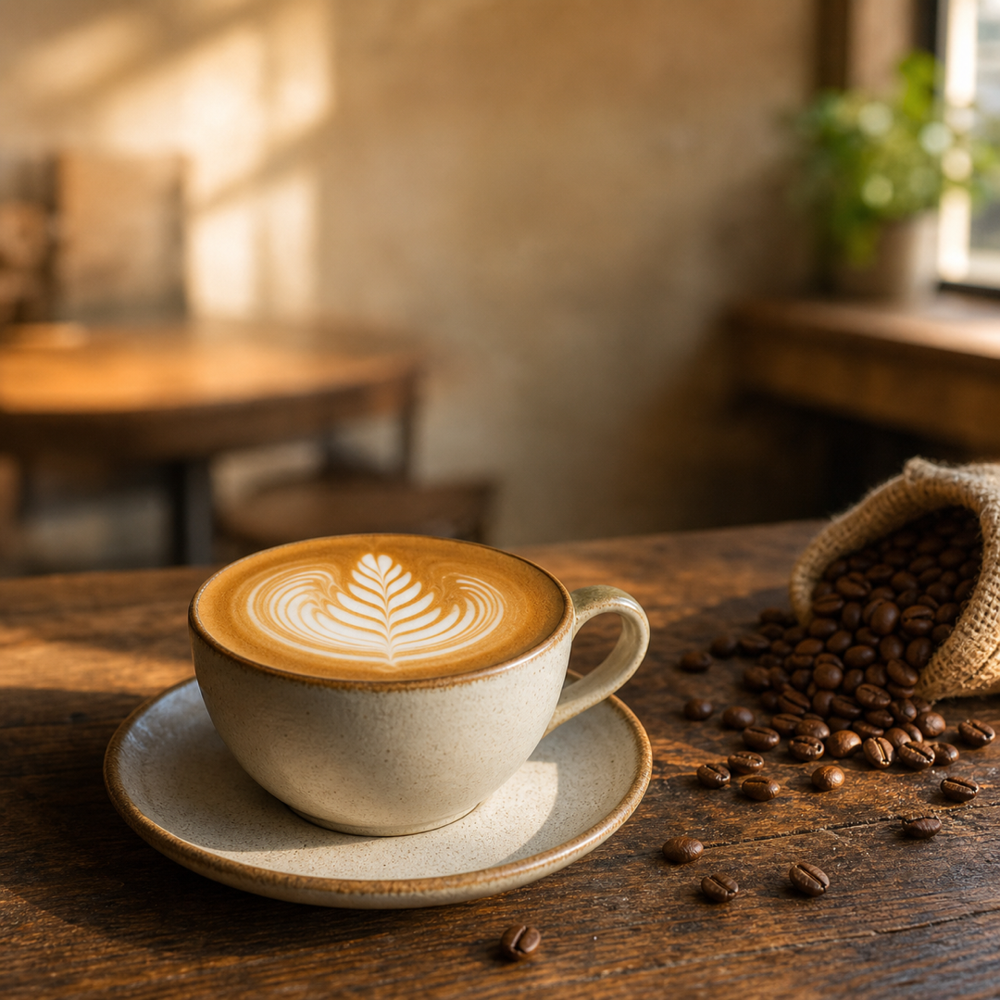
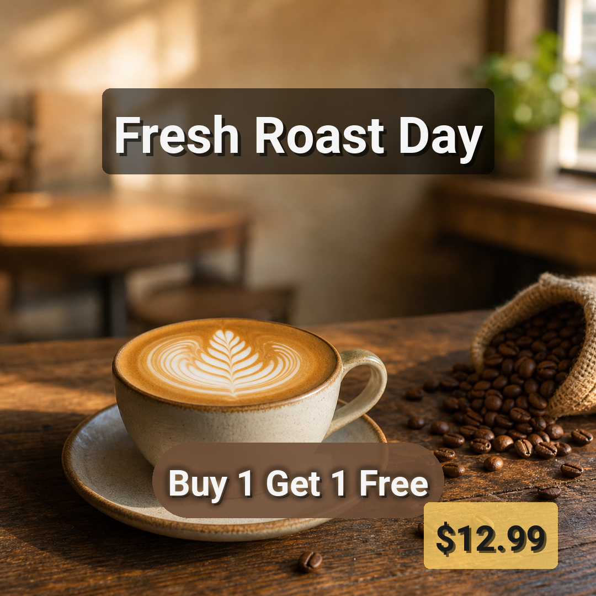
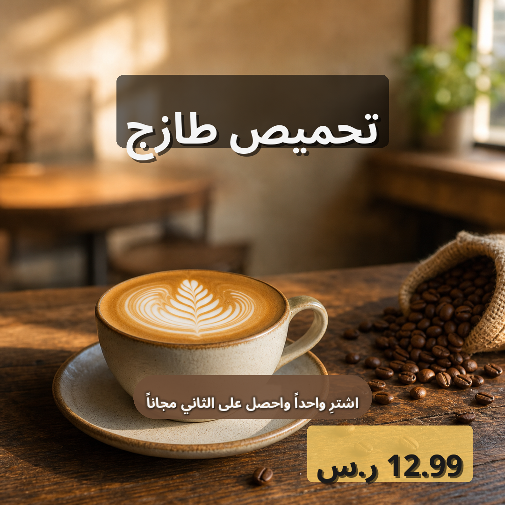
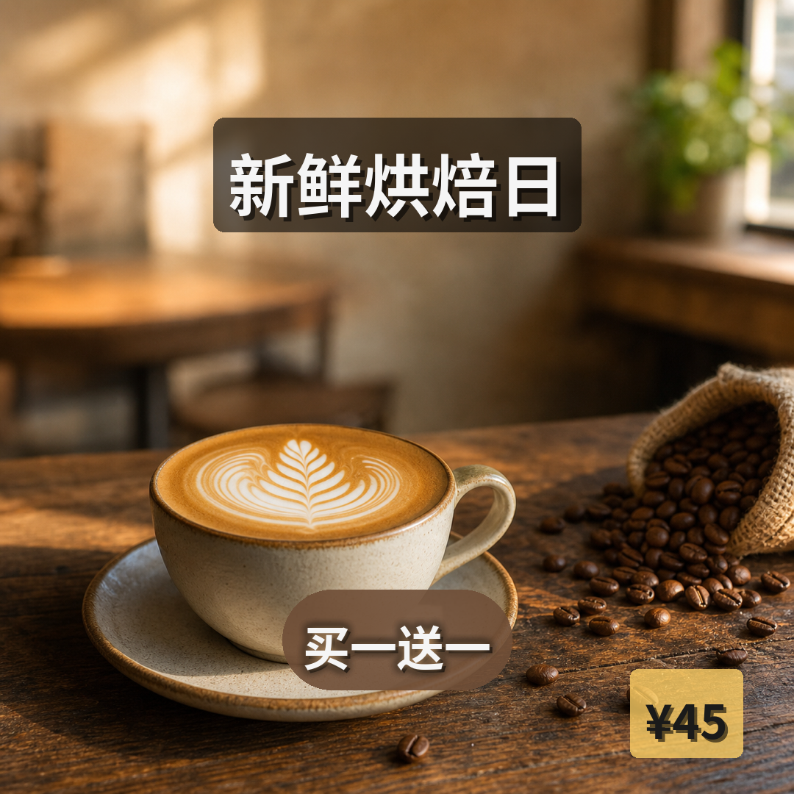

# coffee_promo Preset

Square (1080×1080) promotional template for artisan coffee shops and
cafés — warm cream-and-brown palette with a "fresh roast + BOGOF + price"
stack. Three text layers and translations for seven languages.

## Layout

```
+----------------------------------------+
|                                        |
|             [title]       y=180, 92px  |   <- cream text on auto-dark pill,
|                                        |      sits in top headband opening
|                                        |
|                                        |
|         (cup of coffee, latte art)     |
|                                        |
|                                        |
|         [offer]  y=830, 64px, pill     |   <- coffee-brown pill with
|                                        |      caramel glow + cream text
|                          [price_tag]   |   <- yellow promo sticker,
|                          x=990 y=1010  |      tucked at bottom-right corner
+----------------------------------------+
```

## Text layers

| Name      | Type  | Anchor         | Font size | Effects          | Color    | Backdrop        | Notes |
|-----------|-------|----------------|-----------|------------------|----------|-----------------|-------|
| title     | text  | top-center     | 92        | shadow+backdrop  | #FFF8E7  | auto-dark       | Cream hero, 2 lines, 20px padding |
| offer     | badge | center         | 64        | shadow+glow+backdrop | #FFF8E7 | #6F4E37E6     | Coffee-brown pill, caramel glow, RTL-aware, max_width 680 |
| price_tag | price | bottom-right   | 64        | shadow+backdrop  | #3B2F2F  | #FFD166         | Yellow promo sticker, max_width 320, tucks under the offer's right edge |

The `title` uses `type: text` with `backdrop` so the auto-dark pill wraps
only the text without forcing a strict badge geometry. `offer` is a
`type: badge` so the pill is automatically rounded (radius = half the
text-block height). `price_tag` is `type: price` and renders as a
right-aligned yellow pill — a classic e-commerce sticker. The price
sticker is intentionally narrow (`max_width: 320`) and tucks under the
right side of the offer pill so the two read as a stacked promo unit
rather than competing.

## Safe zones

Three safe zones keep the base image free of distractions where the copy
lands:

- `title_zone` (90, 90) → (990, 350) — title placement
- `offer_zone` (140, 770) → (940, 890) — offer pill placement
- `price_zone` (700, 960) → (1080, 1080) — price sticker placement

## Translations

`translations/<lang>.json` provides the per-language copy for each of
the three layer keys: `title`, `offer`, `price_tag`.

Bundled languages: `en`, `de`, `ja`, `ko`, `ar`, `zh-CN`, `zh-TW`.

The Arabic (`ar`) layer ships `NotoSansArabic-Bold.ttf`; the resolution
path is `I18nManager.get_font_for_language("ar")`. The font has
Arabic-Indic numerals, Arabic comma `،`, and full raqm/RTL shaping. As
with other presets, the font's cmap does **not** include `#`; the copy
already avoids it (no hashtag layer here).

## Usage

```bash
# Validate the preset
.venv/bin/python gen_ecommerce.py validate \
  --config presets/coffee_promo/template.yaml

# Render one language
.venv/bin/python gen_ecommerce.py render \
  --config presets/coffee_promo/template.yaml \
  --base-image presets/coffee_promo/sample_base_image.png \
  --lang en \
  --output presets/coffee_promo/examples/coffee_promo_en.png

# Render every language
.venv/bin/python gen_ecommerce.py batch \
  --config presets/coffee_promo/template.yaml \
  --base-image presets/coffee_promo/sample_base_image.png \
  --output-dir presets/coffee_promo/examples/
```

To add another language, drop a `<code>.json` file with the same three
keys (`title`, `offer`, `price_tag`) into `translations/` — no config
changes are required.

## Showcase



*Base image — 1080×1080 cozy cafe scene with a flat white on a wooden table, scattered beans, warm morning light; generated by `codex-image-gen`.*



*English render — "Fresh Roast Day" cream text on auto-dark pill, "Buy 1 Get 1 Free" coffee-brown pill with caramel glow, "$12.99" yellow promo sticker tucked at the bottom-right.*



*Arabic render — RTL anchors applied for the offer pill; Arabic copy rendered with `NotoSansArabic-Bold.ttf` and proper raqm shaping; "12.99 ر.س" yellow sticker at bottom-right.*



*Chinese render — "新鲜烘焙日" hero, "买一送一" coffee-brown pill, "¥45" yellow sticker; CJK font (`NotoSansCJKsc-Bold.otf`).*