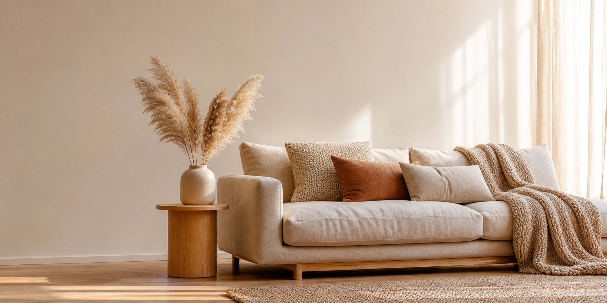
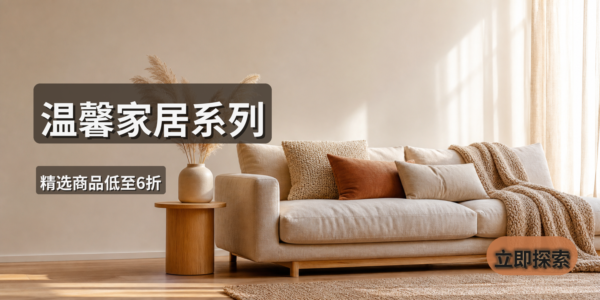
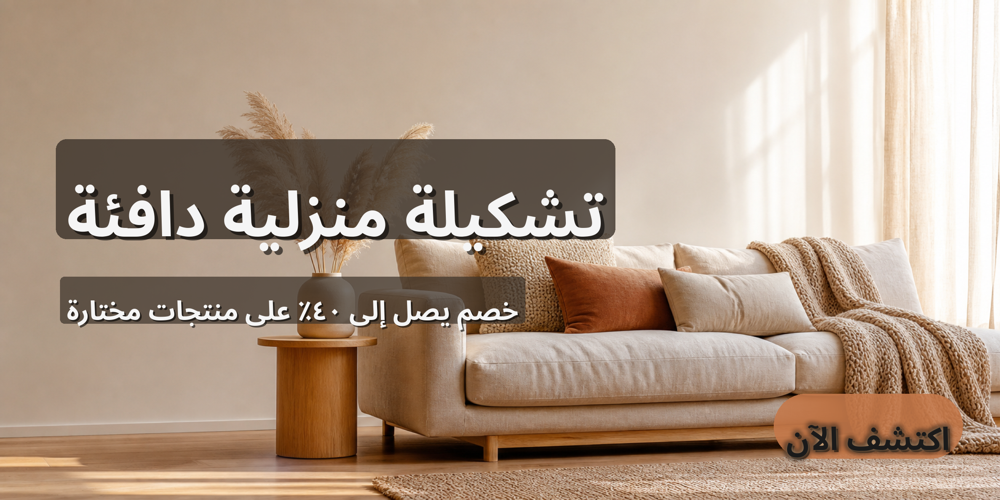

# home_decor_banner 预设

北欧家居横幅（home decor banner）预设，适用于 2400×1200 的横版宽屏画布，
主打米色、奶白、陶土橙的暖色系家居场景，覆盖 `banner` 类型电商物料。

## 画布

- 尺寸：2400 × 1200
- 场景类型：`banner`
- 输出格式：`png`，质量 95

## 多语言

预设内置七种语言，分别对应 `translations/` 目录下的同名 JSON 文件：

- `en` — English
- `de` — Deutsch
- `ja` — 日本語
- `ko` — 한국어
- `zh-CN` — 简体中文
- `zh-TW` — 繁體中文
- `ar` — العربية（RTL，PIL raqm 整形，阿拉伯语字形与连写正确）

每份 JSON 仅包含三个键：`headline`、`subheadline`、`cta`，与
`template.yaml` 中的文字层一一对应。阿拉伯语翻译中的数字采用 Arabic-Indic
数字（`٤٠٪`），避免 PIL 在 RTL 文本中混排 Latin 数字时的字形丢失问题；
`NotoSansArabic-Bold.ttf` 不含 `#` 字形，故阿语翻译一律不出现井号。

## 文件结构

```
presets/home_decor_banner/
├── README.md
├── sample_base_image.md
├── sample_base_image.png
├── template.yaml
├── translations/
│   ├── en.json
│   ├── de.json
│   ├── ja.json
│   ├── ko.json
│   ├── zh-CN.json
│   ├── zh-TW.json
│   └── ar.json
└── examples/
    ├── home_decor_banner_en.png
    ├── home_decor_banner_ar.png
    └── home_decor_banner_zh-CN.png
```

`template.yaml` 是预设的主配置文件，包含画布尺寸、Safe Zones、三个文字层
（`headline` / `subheadline` / `cta`）以及默认翻译 `translations_file:
"translations/en.json"`。

新增语言时，只需要在 `translations/` 下添加同结构的 `<code>.json` 即可，
无需改动 `template.yaml`。

## 排版设计

底图是北欧客厅场景照（米色亚麻沙发、纹理抱枕、温暖针织毯、陶瓷花瓶
+ 蒲苇、浅橡木边几、午后柔光），文字层不能依赖纯色背景，必须借助效果
保证可读性，同时和暖色系家具氛围呼应：

- **headline**：`top-left` 锚点（`x=160, y=360`），字号 150，奶白
  `#FDF6EC` 文字 + `shadow` + 半透明暖棕黑 backdrop（`#3E342BD0`，
  约 81% 不透明），padding 26，长条衬底在沙发 / 墙面上划出独立的高对比区。
- **subheadline**：`top-left` 锚点（`x=160, y=680`），紧贴 headline 下沿，
  字号 64，米白 `#F5EDE0` 文字 + `shadow` + 半透明暖棕黑 backdrop
  （`#3E342BB8`，约 72% 不透明），padding 16。
- **cta**：`bottom-right` 锚点（`x=2280, y=1070`），字号 76，`badge` 类型
  + `pill` 胶囊形（半径=高度一半），陶土橙背景 `#C4784AE6`（约 90% 不透明）
  + 奶白字 `#FDF6EC` + `shadow` + `glow`（`glow_color #E8B98A`，淡桃光
  晕），右下角不超出画布。

`rtl_flip: false`：文字位置在 LTR/RTL 间保持一致（headline 在左上、CTA 在
右下），靠 PIL 的 `direction="rtl"` 实现阿语右起连写；如果打开 `rtl_flip`
会把 `top-left` 翻成 `top-end`，阿语长字串的 `line_x = x − text_width` 会算
到画布外（与 `shopify_banner` 早期同款陷阱），所以此 preset 与
`shopify_banner` 一律选 `false`。

## 校验

使用项目虚拟环境中的 `config_loader.py` 对预设进行 schema 校验：

```bash
/Users/cong/Documents/AI_Project/GenImageText/.venv/bin/python scripts/config_loader.py presets/home_decor_banner/template.yaml
```

或用 CLI 一站式校验（schema + safe zones + i18n + 翻译键覆盖）：

```bash
/Users/cong/Documents/AI_Project/GenImageText/.venv/bin/python gen_ecommerce.py validate --config presets/home_decor_banner/template.yaml
```

## Showcase

展示图由 `codex-image-gen` 生成底图，再经 GenImageText pipeline（PIL 渲染
后端 + 美学排版引擎）渲染文字层得到。

### 底图（base image）



*由 `codex-image-gen` 生成：2400×1200 横版北欧客厅场景（米色亚麻沙发 + 暖色
抱枕 + 蒲苇 + 午后柔光），左上 / 右下留白，无文字、logo、水印。*

### 英文成品（English render）


*Roboto Bold 渲染：`Cozy Home Collection` 头条大字加阴影和暖棕黑 backdrop，
落在左上空白区；`Up to 40% off selected items` 副标题紧随其下；`Explore
Now` 陶土橙 pill 按钮在右下角，pill 边缘带淡桃色光晕。*

### 简体中文成品（Simplified Chinese render）



*NotoSansCJKsc-Bold 渲染：`温馨家居系列` / `精选商品低至6折` / `立即探索`，
排版与英文成品一致，PIL 按路径加载 CJK 字体字形完整、字面正确。*

### 阿拉伯文成品（Arabic render）



*NotoSansArabic-Bold + raqm 整形渲染：`تشكيلة منزلية دافئة` / `خصم يصل إلى
٤٠٪ على منتجات مختارة` / `اكتشف الآن`。阿语从右向左连写、字形与连写规则
正确，数字使用 Arabic-Indic 字形（`٤٠٪`），位置与英文 / 中文版保持视觉
一致。*
