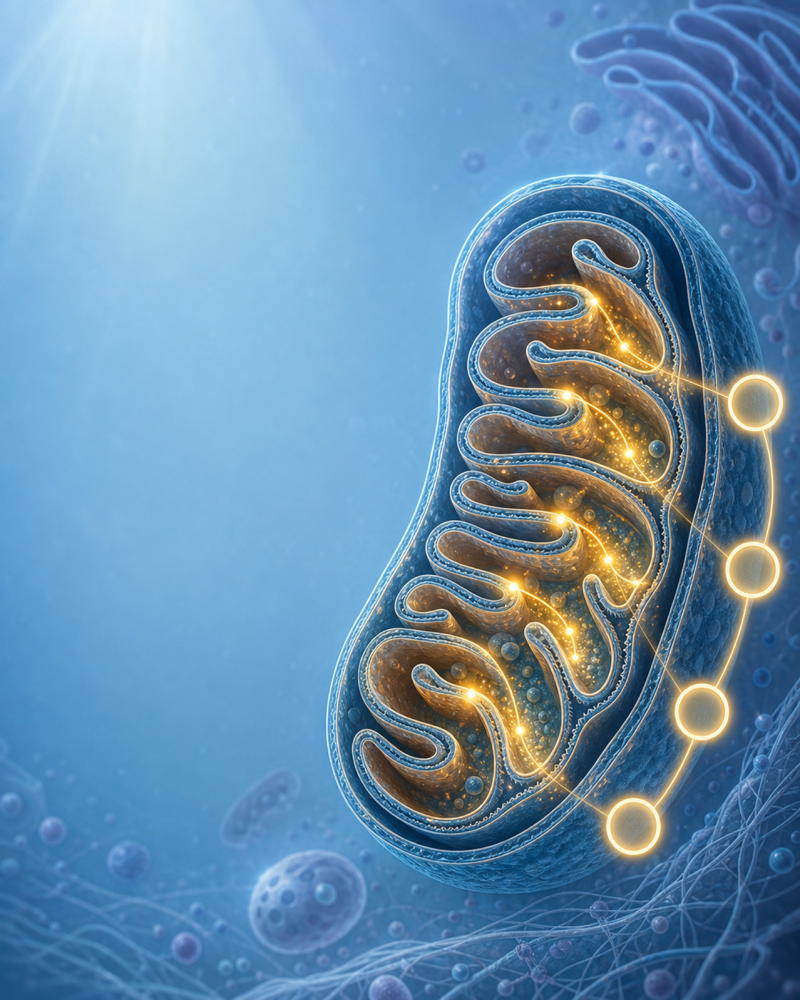
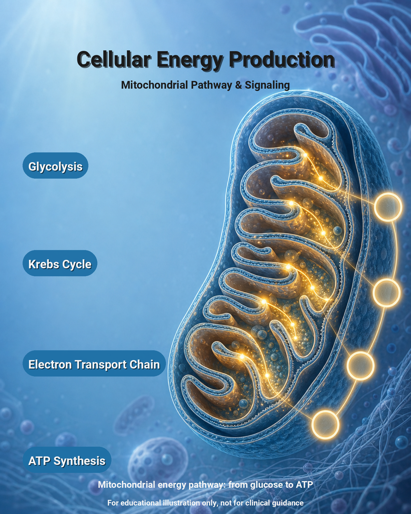
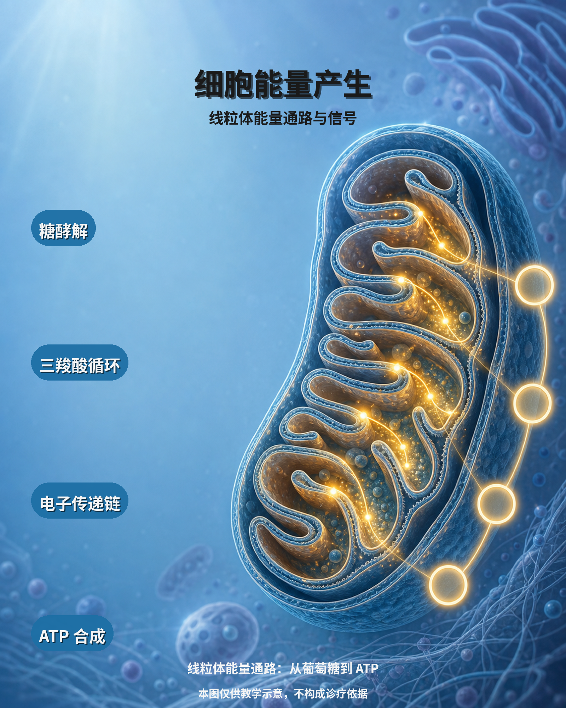
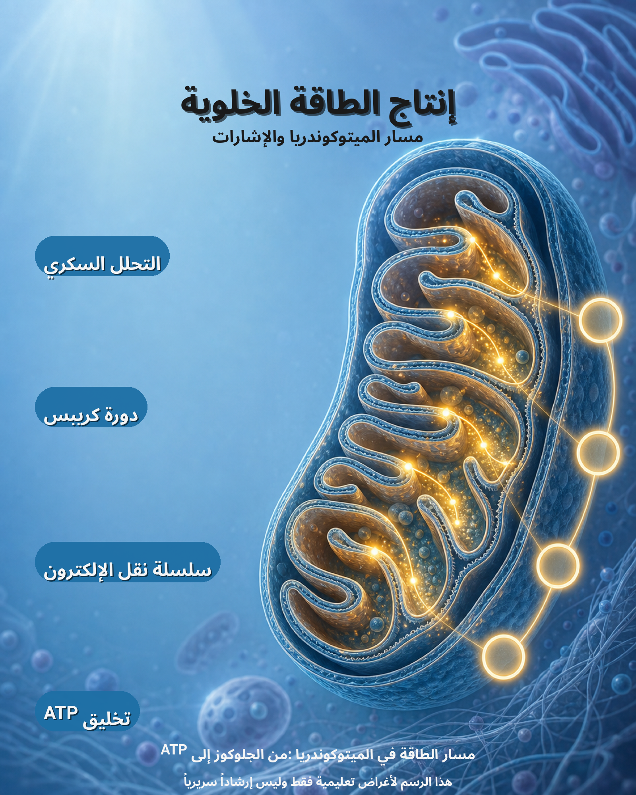

# medical_mechanism Preset

A 1600×2000 vertical educational illustration that maps the four
mitochondrial energy-production stages (glycolysis → Krebs cycle →
electron transport chain → ATP synthesis) onto a cross-section of a
mitochondrion. The base image is a soft-blue cytoplasm with a glowing
cristae; the four text pills sit on the left and align with four glowing
nodes on the right that act as the visual anchors for each stage.

Intended for biology teaching, scientific journals, medical-academic
posters, biopharma education decks, and investor materials that need a
"how cells make ATP" schematic.

## Use cases

- Biology / biochemistry teaching slides and textbooks
- Medical-academic figures (mechanism of action explainers)
- Biopharma patient-education and scientific-communication materials
- Investor-deck biology background

## Layout

```
+----------------------------------------------------------+
|                       TITLE  (top-center)                |
|                      SUBTITLE                             |
|                                                           |
|  +-------------------+                                    |
|  |  stage1 GLYCOLYSIS| --------o  node1 (top)             |
|  +-------------------+                                    |
|                                                           |
|  +-------------------+                                    |
|  |  stage2  KREBS    | --------o  node2                   |
|  +-------------------+                                    |
|                                                           |
|  +-------------------+                                    |
|  |  stage3  ETC      | --------o  node3                   |
|  +-------------------+                                    |
|                                                           |
|  +-------------------+                                    |
|  |  stage4  ATP      | --------o  node4                   |
|  +-------------------+                                    |
|                                                           |
|                       CAPTION  (bottom-center)            |
+----------------------------------------------------------+
```

The four blue pills on the left align horizontally with the four
softly glowing nodes that run down the right side of the base image.
Subtle y adjustments may be required after the first render — see the
**Usage** section.

## Text layers

| Name    | Type   | Anchor        | Font size | Effects                | Color / Backdrop                  | Notes                |
|---------|--------|---------------|-----------|------------------------|-----------------------------------|----------------------|
| title   | text   | top-center    | 84        | shadow                 | `#0B3C5D` (deep clinical blue)    | max_width 1400, 2 lines |
| subtitle| text   | top-center    | 42        | —                      | `#4A6076` (muted gray-blue)       | max_width 1300       |
| stage1  | badge  | left          | 46        | backdrop + shadow      | white text on `#1D6FA5F2` pill    | Glycolysis, y=615    |
| stage2  | badge  | left          | 46        | backdrop + shadow      | white text on `#1D6FA5F2` pill    | Krebs cycle, y=995   |
| stage3  | badge  | left          | 46        | backdrop + shadow      | white text on `#1D6FA5F2` pill    | ETC, y=1385          |
| stage4  | badge  | left          | 46        | backdrop + shadow      | white text on `#1D6FA5F2` pill    | ATP synthesis, y=1760|
| caption | text   | bottom-center | 36        | —                      | `#4A6076` (muted gray-blue)       | max_width 1450, 2 lines, y=1905 |
| note    | text   | bottom-center | 30        | —                      | `#6B7E93` (lighter gray-blue)     | risk-boundary line, y=1972, max_width 1500 |

All layers use `Roboto-Bold.ttf` with the standard CJK fallback chain
(`NotoSansCJKsc-Bold.otf`, `NotoSansCJKtc-Bold.otf`,
`NotoSansCJKkr-Bold.otf`) and `NotoSansArabic-Bold.ttf` for Arabic.

## Palette

The base image is a cool blue cytoplasm with golden energy accents, so
the text layers are tuned to a clinical-blue palette rather than
fighting it:

- `#0B3C5D` deep clinical blue — title (journal-figure authority)
- `#FFFFFF` pure white — stage pill text
- `#1D6FA5` clinical blue — stage pill backdrop (the journal-paper blue
  used by NEJM / Lancet figures), 95% alpha for slight translucency
- `#4A6076` muted gray-blue — subtitle and caption (subordinate, does
  not compete with the title)

## Safe zones

- `title_zone` (100, 80) → (1500, 360) — top-center title + subtitle band
- `stages_zone` (60, 380) → (780, 1820) — left column for the four stage pills
- `caption_zone` (100, 1830) → (1500, 1970) — bottom-center caption band,
  with the smaller `note` disclaimer line directly beneath it (y=1972)

## Translations

Bundled languages: `en`, `de`, `ja`, `ko`, `ar`, `zh-CN`, `zh-TW`.

The Arabic translation uses `NotoSansArabic-Bold.ttf` automatically via
the font fallback chain. Because the project Arabic typeface does not
cover Latin glyphs, the Arabic copy uses the full Arabic form of
"ATP" (`الأدينوسين الثلاثي الفوسفات`) instead of the Latin abbreviation
so every pill renders without missing-glyph placeholders. The renderer
flips horizontal alignment for RTL automatically.

| Key     | Meaning                                              |
|---------|------------------------------------------------------|
| title   | Top headline                                         |
| subtitle| One-line pathway tagline                             |
| stage1  | Glycolysis (التحلل السكري)                            |
| stage2  | Krebs cycle (دورة كريبس)                              |
| stage3  | Electron transport chain (سلسلة نقل الإلكترون)      |
| stage4  | ATP synthesis (تخليق الأدينوسين الثلاثي)             |
| caption | One-line summary shown at the bottom of the figure   |
| note    | Educational-use disclaimer (risk boundary, small but readable) |

## Usage

```bash
# 1. Validate the template (exits 0 on a healthy config)
.venv/bin/python gen_ecommerce.py validate \
  --config presets/medical_mechanism/template.yaml

# 2. Render a single language on top of the base image
.venv/bin/python gen_ecommerce.py render \
  --config presets/medical_mechanism/template.yaml \
  --base-image presets/medical_mechanism/sample_base_image.png \
  --lang en \
  --output presets/medical_mechanism/examples/medical_mechanism_en.png

# 3. Render every bundled language in one pass
.venv/bin/python gen_ecommerce.py batch \
  --config presets/medical_mechanism/template.yaml \
  --base-image presets/medical_mechanism/sample_base_image.png \
  --output-dir presets/medical_mechanism/examples
```

If the four pills do not line up with the glowing nodes on the right
after the first render, nudge the four `y:` values inside
`template.yaml` (`stage1` ≈ 615, `stage2` ≈ 995, `stage3` ≈ 1385,
`stage4` ≈ 1760) and re-render.

## Showcase

### Base image



*Source illustration: mitochondrion cross-section with cristae, golden
electron-flow accents and four glowing pathway nodes down the right
side. The left side is intentionally left empty for the text layer
column.*

### English render



*Glycolysis → Krebs cycle → Electron transport chain → ATP synthesis,
with the journal-style title and caption framed by the four blue pills
on the left.*

### Chinese render



*糖酵解 → 三羧酸循环 → 电子传递链 → ATP 合成；CJK fallback chain
applies automatically.*

### Arabic render



*Same composition with right-to-left text alignment; horizontal
anchors are flipped automatically by the renderer.*

All three figures are rendered by the same `template.yaml` with the
layout engine enabled, so swapping the four stage keys in
`translations/<lang>.json` is enough to produce a fully localized
version of the diagram.
