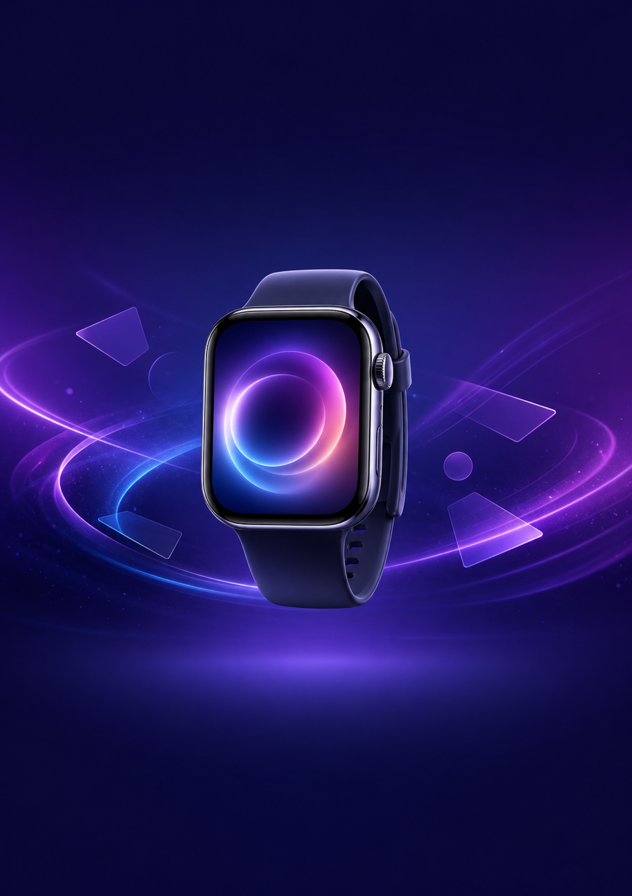
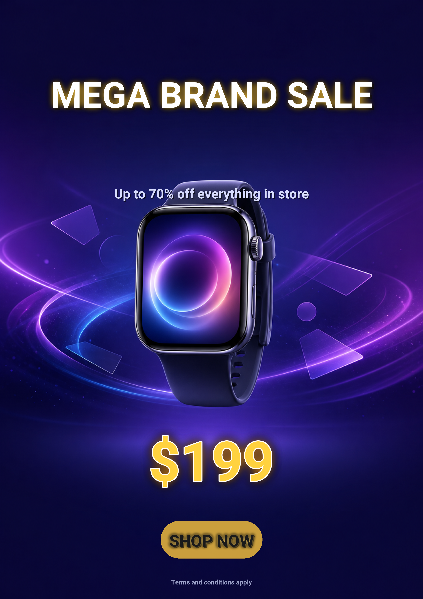
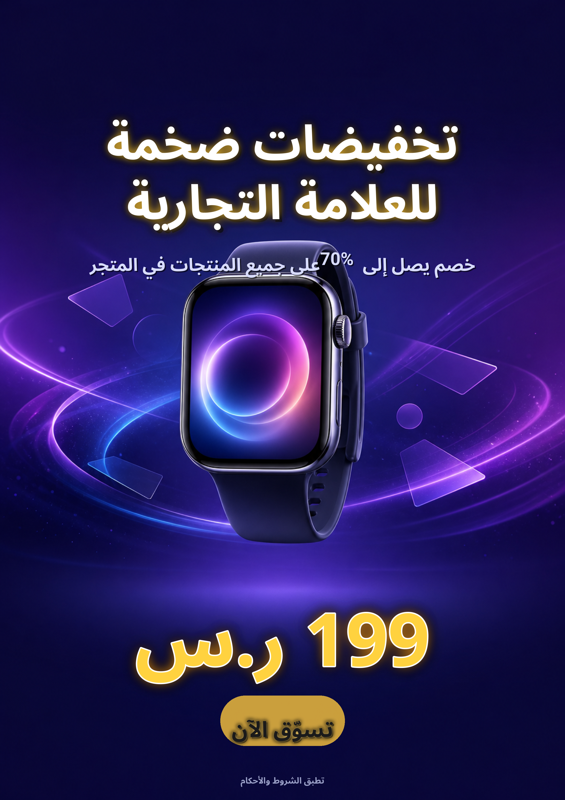
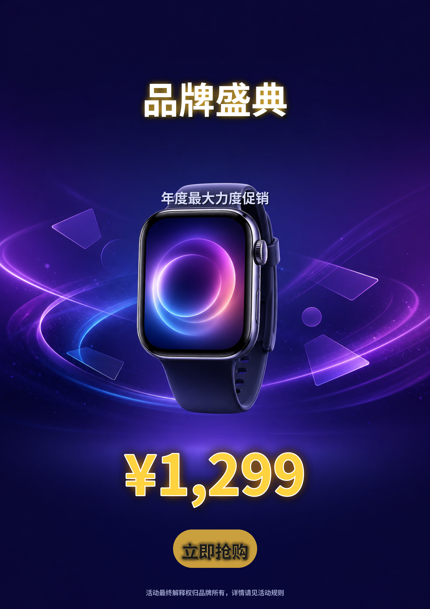

# poster_a4 Preset

A4 print-ready poster template (2480×3508 @ 300 dpi) for brand sale / promotional
campaigns. Five text layers with premium promotional typography — bold white
title with gold glow, hero price with white outline and warm halo, gilded CTA
pill — and translations for seven languages.

## Layout

```
+----------------------------------------+
|  [title]            y=410,  210px      |   <- top safe zone
|                                        |      shadow + gold glow
|  [subtitle]         y=1080, 78px       |      soft cool gray
|                                        |
|             (smartwatch hero)          |
|                                        |
|       [price]         y=2480, 320px    |   <- middle safe zone
|                                        |      gold + white outline + orange glow
|       [cta]           y=3220, 96px     |   <- bottom safe zone
|                                        |      gold pill badge, dark text
|       [disclaimer]    y=3430, 38px     |
+----------------------------------------+
```

## Text layers

| Name        | Type   | Anchor          | Font size | Effects              | Color / Backdrop                  | rtl_flip |
|-------------|--------|-----------------|-----------|----------------------|-----------------------------------|----------|
| title       | text   | top-center      | 210       | shadow, glow         | `#FFFFFF` text, gold glow         | true     |
| subtitle    | text   | top-center      | 78        | shadow               | `#D8DCFF`                         | false    |
| price       | price  | center          | 320       | outline (6px white), glow | `#FFD23F` text, `#FF9F1C` glow | false    |
| cta         | badge  | bottom-center   | 96        | backdrop, glow, shadow (pill) | `#FFC83D` pill, `#1B1235` text | false    |
| disclaimer  | text   | bottom-center   | 38        | -                    | `#9AA0C7`                         | false    |

All five layers are validated against the optional PIL-renderer knobs in
`scripts/text_layer` (`backdrop_color`, `stroke_color`, `stroke_width`,
`glow_color`, `padding`). The CTA's `type="badge"` plus `backdrop` effect
auto-renders a pill-shaped gold button.

## Safe zones

Three safe zones (in `safe_zones`) tell the image-generation step where the
text will land, so the prompt and inpainting mask can keep those regions
clear of busy detail:

- `title_zone` (200, 250) → (2280, 1100)   — title + subtitle
- `price_zone` (200, 2300) → (2280, 2800)  — focal price
- `cta_zone`   (200, 3000) → (2280, 3450)  — CTA + disclaimer

## Translations

`translations/<lang>.json` provides the per-language copy for each of the
five layer keys: `title`, `subtitle`, `price`, `cta`, `disclaimer`.

Bundled languages: `en`, `de`, `ja`, `ko`, `ar`, `zh-CN`, `zh-TW`. Arabic is
shaped with raqm through PIL (NotoSansArabic-Bold.ttf); Chinese / Japanese /
Korean render with the Noto CJK faces from `assets/fonts/`.

## Usage

```python
import sys
sys.path.insert(0, "scripts")

from config_loader import load_config, validate_config_file
from i18n_manager import I18nManager

cfg = load_config("presets/poster_a4/template.yaml")
warnings = validate_config_file("presets/poster_a4/template.yaml")
for w in warnings:
    print("WARN:", w)

i18n = I18nManager("presets/poster_a4/translations")
for lang in i18n.get_all_languages():
    print(lang, i18n.get_translation("title", lang))
```

To add another language, drop a `<code>.json` file with the same five keys
into `translations/` — no config changes are required.

## Render a single language

```bash
.venv/bin/python gen_ecommerce.py render \
    --config presets/poster_a4/template.yaml \
    --base-image presets/poster_a4/sample_base_image.png \
    --lang <LANG> \
    --output presets/poster_a4/examples/poster_a4_<LANG>.png
```

## Showcase

### Base image


*Base background generated by `codex-image-gen` (2480×3508, no embedded text).
Deep navy-to-purple gradient with a centered smartwatch hero (glowing abstract
watch face, dynamic light streaks, subtle geometric shapes), clear top/bottom
safe zones.*

### Rendered variants


*English (`en`) — "MEGA BRAND SALE" stacks on a single line; subtitle in soft
cool gray; `$199` gold focal price with white outline and warm halo; SHOP NOW
on a gold pill button.*


*Arabic (`ar`) — title wraps onto two right-aligned lines ("تخفيضات ضخمة /
للعلامة التجارية") with the same gold glow; subtitle and price are RTL-shaped
through raqm so digits stay readable left-to-right inside the RTL run;
"تسوّق الآن" sits in the same gilded pill.*


*Chinese (`zh-CN`) — "品牌盛典" anchors the top with the same gold glow;
"¥1,299" reads as the price focal; "立即抢购" lands in the gold pill at the
same vertical position as the other variants.*

The smartwatch hero (floating in the middle of the deep navy-to-purple
gradient) ties all three variants together — its warm-glow dial visually
echoes the gold halo on the price text.

All three posters are rendered by the same `template.yaml` with the layout
engine enabled — positions, contrasts and effect enhancements are recorded in
the per-layer `layout_adjustments` block of every render report.
