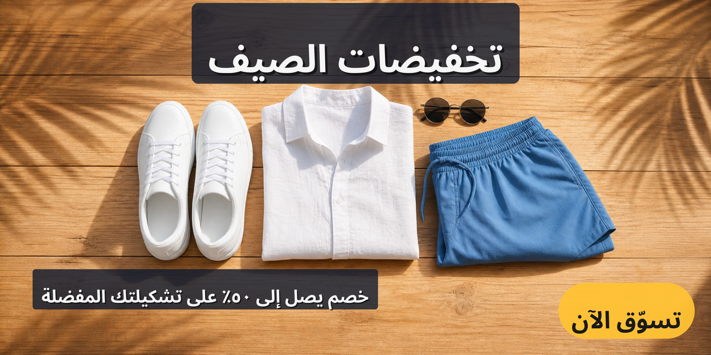

# shopify_banner 预设

Shopify 店铺首页横幅预设，适用于 2400×1200 的横版宽屏画布。

## 画布

- 尺寸：2400 × 1200
- 场景类型：`banner`
- 输出格式：`png`，质量 95

## 多语言

预设内置七种语言，分别对应 `translations/` 目录下的同名 JSON 文件：

- `en` — English
- `de` — Deutsch
- `ja` — 日本語
- `ko` — 한국어
- `zh-CN` — 简体中文
- `zh-TW` — 繁體中文
- `ar` — العربية（RTL，PIL raqm 整形，阿拉伯语字形与连写正确）

每份 JSON 仅包含三个键：`headline`、`subheadline`、`cta`。
阿拉伯语翻译中的数字采用 Arabic-Indic 数字（`٥٠٪`），避免 PIL 在
RTL 文本中混排 Latin 数字时的字形丢失问题。

## 文件结构

```
presets/shopify_banner/
├── README.md
├── sample_base_image.md
├── sample_base_image.png
├── template.yaml
├── translations/
│   ├── en.json
│   ├── de.json
│   ├── ja.json
│   ├── ko.json
│   ├── zh-CN.json
│   ├── zh-TW.json
│   └── ar.json
└── examples/
    ├── shopify_banner_en.png
    ├── shopify_banner_ar.png
    └── shopify_banner_zh-CN.png
```

`template.yaml` 是预设的主配置文件，包含画布尺寸、Safe Zones、三个文字层
（`headline` / `subheadline` / `cta`）以及默认翻译 `translations_file:
"translations/en.json"`。

新增语言时，只需要在 `translations/` 下添加同结构的 `<code>.json` 即可，
无需改动 `template.yaml`。

## 排版设计

此预设底图是明亮夏日平铺生活场景照片（日照木质表面 + 白色运动鞋
/ 白色夏季衬衫 / 蓝色短裤 / 太阳镜 + 热带叶影），文字层不能依赖纯色
背景，必须借助效果保证可读性：

- **headline**：safe zone `x=60, y=10, width=2280, height=290`；layer
  锚点 `top-center`（`x=1200, y=65`），字号 130，`max_lines=1`，
  `padding=55`，白色文字 + `shadow` + 半透明深色 backdrop
  （`#0F1A2ECC`，约 80% 不透明深蓝炭色），顶部水平居中。
- **subheadline**：safe zone `x=100, y=900, width=1300, height=150`；layer
  锚点 `top-left`（`x=140, y=940`），字号 60，`max_lines=1`，
  `max_width=1300`，`padding=30`，白色文字 + `shadow` + 同款
  `#0F1A2ECC` 半透明深蓝炭色 backdrop，落在底部左侧。
- **cta**：safe zone `x=1620, y=920, width=680, height=220`；layer
  锚点 `bottom-right`（`x=2300, y=1100`），字号 80，`padding=44`，
  `badge` 类型 + `backdrop`（pill 胶囊形，半径=高度一半），饱和夏日
  黄背景 `#FFC233F2` + 深色文字 `#1A1A1A`，右下角留边。

`rtl_flip: false`：文字位置在 LTR/RTL 间保持一致（headline 顶部居中、
CTA 在右下），靠 PIL 的 `direction="rtl"` 实现阿语右起连写，避免
`rtl_flip` 翻转锚点后阿语长字串向左溢出画布的问题。

## 校验

使用项目虚拟环境中的 `config_loader.py` 对预设进行 schema 校验：

```bash
/Users/cong/Documents/AI_Project/GenImageText/.venv/bin/python scripts/config_loader.py presets/shopify_banner/template.yaml
```

或用 CLI 一站式校验（schema + safe zones + i18n + 翻译键覆盖）：

```bash
/Users/cong/Documents/AI_Project/GenImageText/.venv/bin/python gen_ecommerce.py validate --config presets/shopify_banner/template.yaml
```

## Showcase

展示图由 `codex-image-gen` 生成底图，再经 GenImageText pipeline（PIL 渲染
后端 + 美学排版引擎）渲染文字层得到。

### 底图（base image）


*由 `codex-image-gen` 生成：2400×1200 横版夏日平铺场景（明亮日照木质表面 + 白色运动鞋 / 白色夏季衬衫 / 蓝色短裤 / 太阳镜 + 热带叶影），无文字、logo、水印。*

### 英文成品（English render）


*Roboto Bold 渲染：`Summer Sale` 顶部居中大字（白字 + 阴影 + `#0F1A2ECC` 深蓝炭色 backdrop）；`Up to 50% off your favorite styles` 副标题落在底部左侧（白字 + 阴影 + 同款 backdrop）；`Shop Now` 饱和夏日黄 pill（`#FFC233F2` + 深色字）按钮在右下角。*

### 简体中文成品（Simplified Chinese render）


*NotoSansCJKsc-Bold 渲染：`夏季大促` / `全场最高5折起` / `立即选购`，排版与英文成品一致，PIL 按路径加载 CJK 字体字形完整、字面正确。*

### 阿拉伯文成品（Arabic render）



*NotoSansArabic-Bold + raqm 整形渲染：`تخفيضات الصيف` / `خصم يصل إلى ٥٠٪ على تشكيلتك المفضلة` / `تسوّق الآن`。阿语从右向左连写、字形与连写规则正确，数字使用 Arabic-Indic 字形（`٥٠٪`），位置与英文/中文版一致。*