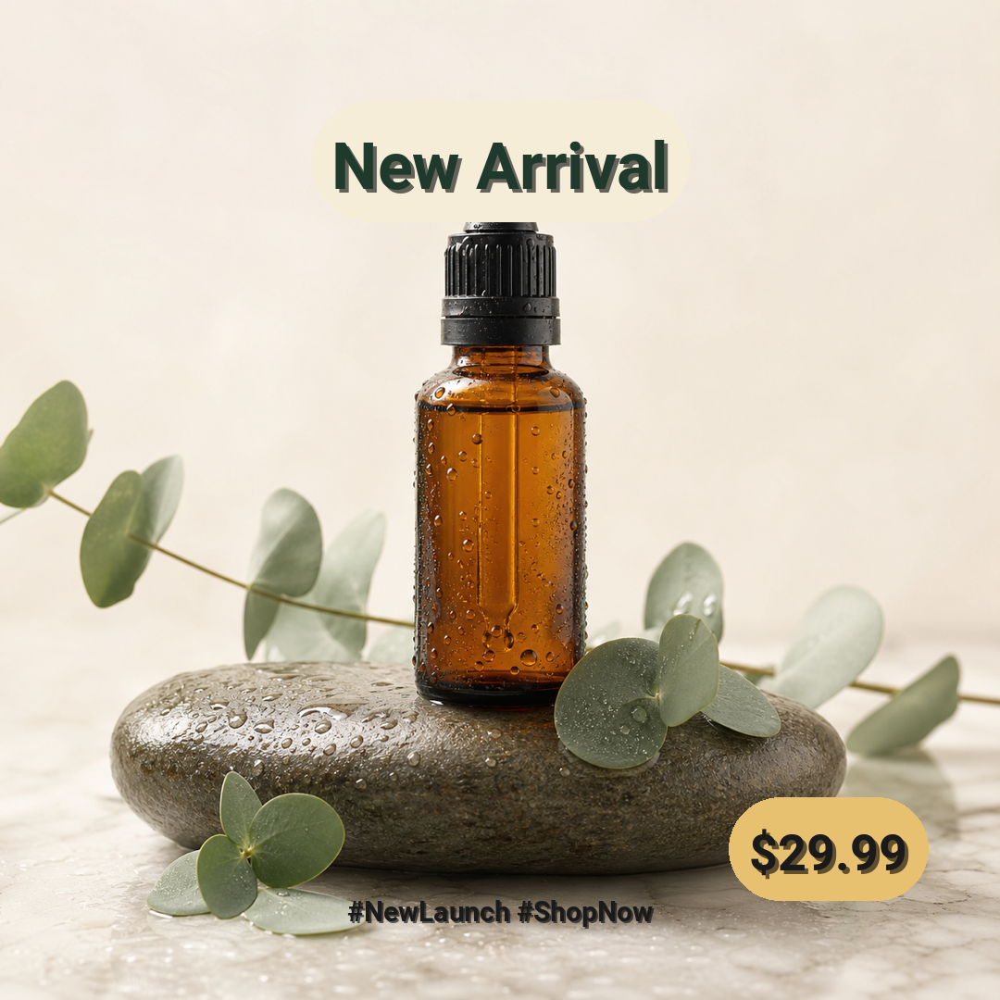
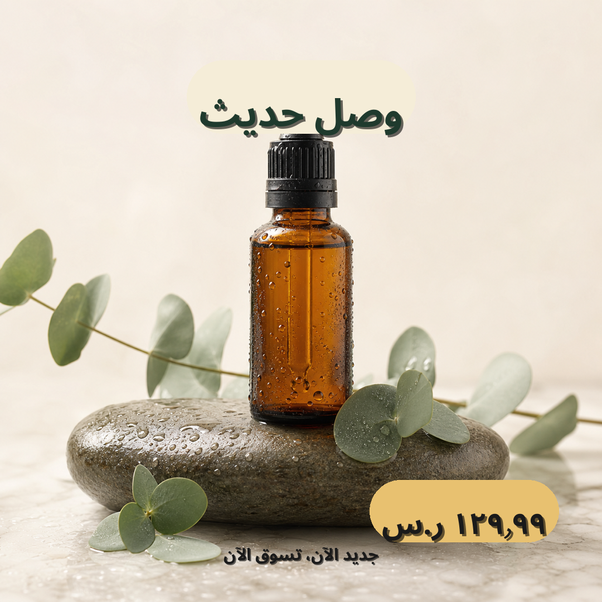
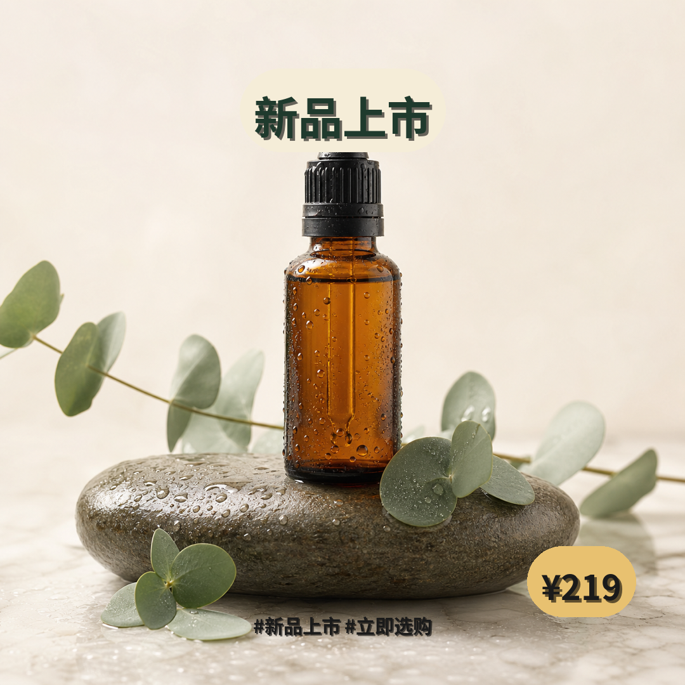

# social_square Preset

Square social-media template (1080×1080) for Instagram and Facebook feed
posts. Three text layers and translations for seven languages. The
showcase is a spa-elegant skincare post — an amber glass serum bottle
on a wet stone with eucalyptus leaves — but the layer copy is
product-agnostic (`New Arrival` / `新品上市` / `وصل حديثاً`), so the
template works for any "new product launch" beat.

## Layout

```
+----------------------------------------+
|                                        |
|             [title]    y=130, 70px     |   <- cream pill, deep sage text
|                                        |
|             [ product + stone +        |
|               eucalyptus ]             |
|                                        |
|                          [price_tag]   |   <- soft warm gold pill
|                          x=980 y=950   |      bottom-right accent
|             [hashtag]  y=1000, 30px    |   <- deep sage text
+----------------------------------------+
```

## Text layers

| Name      | Type  | Anchor       | Font size | Effects             | Text color | Backdrop pill   | Notes |
|-----------|-------|--------------|-----------|---------------------|------------|-----------------|-------|
| title     | badge | top-center   | 70        | shadow + backdrop   | `#1F3A2D`  | `#F5EDD8FF`     | Fully opaque cream pill; sits cleanly above the dropper |
| price_tag | badge | bottom-right | 54        | shadow + backdrop   | `#1F3A2D`  | `#E8C170FF`     | Soft warm gold that ties into the amber bottle |
| hashtag   | text  | bottom-center| 30        | shadow              | `#1F3A2D`  | -               | Deep sage line at the floor, subtle drop shadow |

`type: badge` automatically renders the `backdrop` effect as a pill (round
radius = half the text-block height). The title deliberately uses **no
outline / no glow** — the opaque cream pill plus a soft drop shadow is
enough to read against the muted cream-and-sage background; outline+glow
felt mechanical against a spa photograph.

The title's pill uses an 8-digit hex (`#F5EDD8FF`) so the alpha is 255
instead of the default 200; the dropper would otherwise ghost through a
78%-opaque pill.

## Palette

The base image is amber + wet stone + sage eucalyptus on a cream
backdrop, so the text layers are tuned to that palette rather than
fighting it:

- `#1F3A2D` deep sage green — text on cream / gold pills
- `#F5EDD8` warm cream — title pill (matches background, lifted by the
  fully-opaque alpha)
- `#E8C170` muted gold — price tag (single warm accent, harmonises with
  the amber serum bottle instead of competing with it)

## Safe zones

Four safe zones keep the text areas clean in the base image:

- `top_center_zone` (80, 60) → (1000, 280) — title placement
- `center_zone` (240, 240) → (840, 840) — product area, kept clear
- `bottom_right_zone` (680, 760) → (1080, 1080) — price tag placement
- `bottom_center_zone` (140, 1000) → (940, 1060) — hashtag placement

## Translations

`translations/<lang>.json` provides the per-language copy for each of the
three layer keys: `title`, `price_tag`, `hashtag`.

Bundled languages: `en`, `de`, `ja`, `ko`, `ar`, `zh-CN`, `zh-TW`.

The Arabic (`ar`) layer ships `NotoSansArabic-Bold.ttf`; the resolution path
is `I18nManager.get_font_for_language("ar")`. The font has Arabic-Indic
numerals, Arabic comma `،`, and full raqm/RTL shaping — but its cmap does
not include `#`, `_`, `·`, `|`, `+`, `?`, `(`, `)`, `[`, `]`, `{`, `}`.
The Arabic hashtag therefore uses the Arabic comma `،` as a separator
instead of `#…_…` tokens; the rest of the Arabic text is rendered
faithfully (verified visually with `ReadMediaFile`).

## Usage

```python
import sys
sys.path.insert(0, "scripts")

from config_loader import load_config, validate_config_file
from i18n_manager import I18nManager

cfg = load_config("presets/social_square/template.yaml")
warnings = validate_config_file("presets/social_square/template.yaml")
for w in warnings:
    print("WARN:", w)

i18n = I18nManager("presets/social_square/translations")
for lang in i18n.get_all_languages():
    print(lang, i18n.get_translation("title", lang))
```

To render a single language:

```bash
.venv/bin/python gen_ecommerce.py render \
  --config presets/social_square/template.yaml \
  --base-image presets/social_square/sample_base_image.png \
  --lang en --output examples/social_square_en.png
```

To add another language, drop a `<code>.json` file with the same three keys
into `translations/` — no config changes are required.

## Showcase


*Base image — 1080×1080 spa-aesthetic shot of an amber glass serum bottle with dropper standing on a wet stone, water droplets and soft green eucalyptus leaves around, muted sage-green and cream tones, generous negative space; generated by `codex-image-gen` with `style: photorealistic-natural`.*



*English render — "New Arrival" in a fully-opaque warm cream pill (deep sage text + soft drop shadow) floating above the bottle; "$29.99" soft warm-gold pill in the bottom-right; "#NewLaunch #ShopNow" deep-sage hashtag at the bottom. Rendered by the PIL pipeline with the layout-composer auto-plan; `render_single --lang en`.*



*Arabic render — same layout with RTL anchors applied (`direction="rtl"`, anchor flipped for `rtl_flip: true` layers). Title "وصل حديثاً" uses `NotoSansArabic-Bold.ttf` with proper raqm shaping; price "١٢٩٫٩٩ ر.س" uses Arabic-Indic numerals; hashtag uses Arabic comma `،` as separator (the font lacks `#` / `_` glyphs).*



*Chinese render — "新品上市" hero pill, "¥219" soft warm-gold badge, "#新品上市 #立即选购" hashtag. CJK font (`NotoSansCJKsc-Bold.otf`) renders the square glyphs at native weight; layout is identical to the English variant.*
